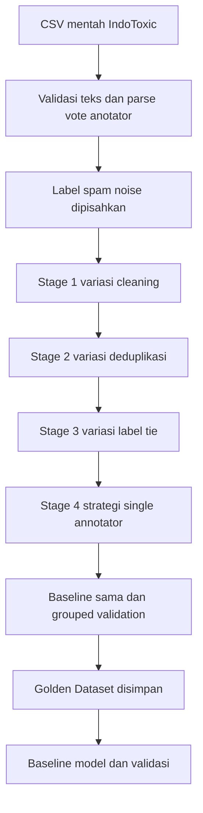

# Indonesian Hate Speech Preprocessing Golden Dataset

Paket ini membangun dan membandingkan kandidat preprocessing sebelum tahap model. Fokus utamanya adalah menghasilkan **Golden Dataset** yang bersih, dapat ditelusuri, dan aman dari kebocoran spam/noise, duplikat, serta label yang tidak pasti.

## Alur yang Diimplementasikan



Setiap stage memilih kandidat dengan **Toxic F1** tertinggi, lalu **Macro F1** sebagai pemecah seri. Semua kandidat, hasil evaluasi, dan dataset perantara disimpan di `artifacts/<run-name>/`; jadi proses dapat diulang tanpa menimpa versi sebelumnya.

## Struktur Folder

```text
HateSpeech_Preprocessing_GoldenDataset/
├── config/experiment.yaml              # Parameter eksperimen
├── data/raw/                           # CSV sumber (ada sample_indotoxic.csv)
├── scripts/                            # Perintah menjalankan pipeline
├── src/preprocessing/                  # Parsing label, cleaning, kandidat, evaluasi
├── src/modeling/                       # Baseline handoff setelah Golden Dataset
├── src/validation/                     # Pemeriksaan ulang test set
├── tests/                              # Tes parsing dan label spam
├── docs/                               # Panduan lengkap Word dan Markdown
└── artifacts/<run-name>/               # Semua hasil tiap pengulangan
```

## Menjalankan di Windows PowerShell

```powershell
cd "HateSpeech_Preprocessing_GoldenDataset"
py -m venv .venv
.\.venv\Scripts\Activate.ps1
python -m pip install --upgrade pip
python -m pip install -r requirements.txt
python scripts/run_preprocessing.py --input data/raw/sample_indotoxic.csv --run-name preprocessing_v1
python scripts/inspect_outputs.py --run-name preprocessing_v1
python scripts/train_baseline.py --run-name preprocessing_v1
python scripts/validate_model.py --run-name preprocessing_v1
```

Untuk data asli, letakkan `indotoxic2024_annotated_data_v2_final.csv` pada `data/raw/`, kemudian ganti bagian `--input` dengan nama file tersebut.

## Aturan Label Spam

`is_noise_or_spam_text` diperlakukan sebagai label independen:

- spam dengan konsensus `1` **tidak pernah** masuk training, validation, atau test;
- label spam `0.5` atau kosong masuk `golden_dataset_review_queue.csv`, bukan dipaksa sebagai non-spam;
- label toxicity pada spam tetap disimpan untuk audit, tetapi tidak dipakai model;
- jumlah spam yang dikeluarkan tercatat di `reports/quality_report.json`.

## Berkas Hasil Penting

| Berkas | Fungsi |
|---|---|
| `processed/golden_dataset_all.csv` | Data valid setelah strategi terpilih, termasuk flag review. |
| `processed/golden_dataset_model_ready.csv` | Satu-satunya input untuk tahap model. |
| `processed/golden_dataset_review_queue.csv` | Spam, tie, atau data lain yang perlu dicek manual. |
| `reports/experiment_results.csv` | Toxic F1 dan Macro F1 setiap kandidat. |
| `reports/selected_strategy.json` | Kombinasi preprocessing yang menang. |
| `reports/quality_report.json` | Ringkasan kualitas dan jumlah spam yang dikeluarkan. |
| `metrics/baseline_metrics.json` | Hasil baseline setelah training. |

## Catatan Akademik

Baseline TF-IDF + SGD hanya dipakai untuk **membandingkan kandidat preprocessing secara konsisten** dan memastikan data siap diteruskan. Untuk proyek Kelompok 6, Golden Dataset tersebut selanjutnya dapat dipakai fine-tuning XLM-RoBERTa dengan split dan konfigurasi yang sama.
