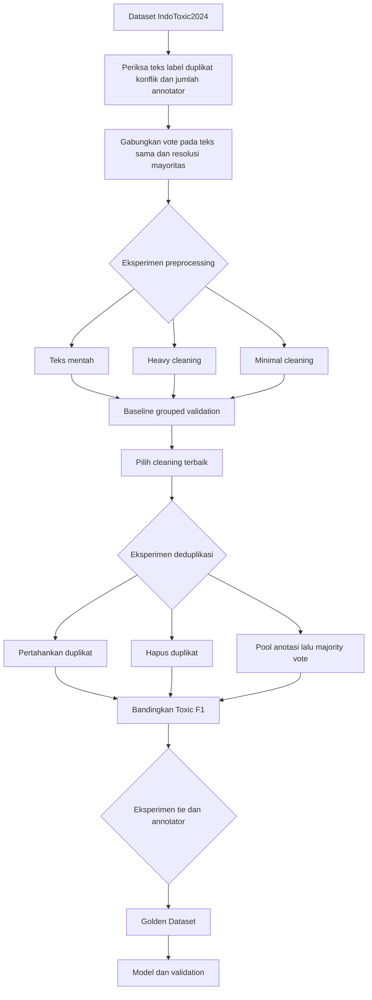

# Panduan Preprocessing Golden Dataset untuk Hate Speech Analyzer

Dokumen ini menjelaskan paket `HateSpeech_Preprocessing_GoldenDataset`. Paket dibuat untuk fase preprocessing sebelum fine-tuning model. Output akhirnya adalah **Golden Dataset**: data yang sudah memiliki jejak keputusan, tidak mencampurkan spam/noise ke data model, tidak membocorkan duplikat antar-split, dan jelas membedakan label keras dengan label tie.

## 1. Alur yang Diikuti



Pipeline menjalankan empat tahap berurutan. Pada setiap tahap, hanya satu strategi yang berubah. Semua strategi dinilai dengan baseline dan split kelompok yang sama. Pemenang adalah strategi dengan **Toxic F1** tertinggi; jika sama, dipilih **Macro F1** tertinggi.

| Tahap | Kandidat yang Dibandingkan | Tujuan |
|---|---|---|
| 1. Cleaning teks | `raw`, `heavy`, `minimal` | Menemukan tingkat pembersihan yang tidak menghilangkan sinyal penting. |
| 2. Deduplikasi | `keep`, `drop`, `pool` | Mencegah data sama masuk ke train dan validation. |
| 3. Label tie | `drop`, `soft`, `downweight` | Menangani vote 50:50 tanpa mengubahnya paksa menjadi 0 atau 1. |
| 4. Anotator | `equal`, `downweight_single`, `multi_only`, `curriculum` | Menguji apakah data single-annotator perlu dibatasi atau diberi bobot lebih kecil. |

## 2. Struktur Folder

```text
HateSpeech_Preprocessing_GoldenDataset/
├── config/
│   └── experiment.yaml
├── data/raw/
│   └── sample_indotoxic.csv
├── scripts/
│   ├── run_preprocessing.py
│   ├── inspect_outputs.py
│   ├── train_baseline.py
│   └── validate_model.py
├── src/
│   ├── preprocessing/
│   │   ├── labels.py
│   │   ├── text_cleaning.py
│   │   ├── candidates.py
│   │   ├── evaluation.py
│   │   └── pipeline.py
│   ├── modeling/baseline.py
│   └── validation/recheck.py
├── tests/
├── docs/
└── artifacts/
    └── preprocessing_v1/
        ├── experiments/
        ├── processed/
        ├── reports/
        ├── models/
        ├── metrics/
        └── splits/
```

Setiap kali eksperimen diulang, gunakan `--run-name` yang baru, misalnya `preprocessing_v2`. Dengan begitu hasil `v1` tetap tersimpan untuk dibandingkan dengan `v2`.

## 3. Aturan Penting untuk Label Spam atau Noise

Kolom sumber yang dipakai adalah `is_noise_or_spam_text`. Label ini **tidak boleh digabung sebagai Non-Toxic** karena spam adalah masalah kualitas data, bukan kelas sentimen atau kelas toxicity.

| Kondisi spam | Perlakuan pipeline | Masuk training? |
|---|---|---|
| Vote mayoritas spam = `1` | Dikirim ke `golden_dataset_review_queue.csv` dengan alasan `spam_or_noise`. | Tidak |
| Vote spam seri = `0.5` | Dikirim ke review queue dengan alasan `spam_label_uncertain`. | Tidak |
| Label spam hilang | Dikirim ke review queue agar diverifikasi. | Tidak |
| Vote mayoritas spam = `0` | Boleh lanjut ke pemeriksaan label toxicity. | Ya, jika syarat lain terpenuhi |

Pipeline menyimpan label toxicity milik spam agar keputusan dapat diaudit, tetapi baris spam tidak digunakan untuk train, validation, atau test. Jumlahnya dilaporkan di `reports/quality_report.json`.

## 4. Menjalankan Pipeline di Windows PowerShell

Jalankan satu per satu.

```powershell
cd "HateSpeech_Preprocessing_GoldenDataset"
py -m venv .venv
.\.venv\Scripts\Activate.ps1
python -m pip install --upgrade pip
python -m pip install -r requirements.txt
```

Jalankan contoh terlebih dahulu untuk memastikan semua folder dan dependency benar.

```powershell
python scripts/run_preprocessing.py --input data/raw/sample_indotoxic.csv --run-name preprocessing_v1
python scripts/inspect_outputs.py --run-name preprocessing_v1
```

Untuk dataset IndoToxic2024 asli, simpan file sebagai berikut:

```text
data/raw/indotoxic2024_annotated_data_v2_final.csv
```

Kemudian jalankan:

```powershell
python scripts/run_preprocessing.py --input data/raw/indotoxic2024_annotated_data_v2_final.csv --run-name preprocessing_indotoxic_v1
python scripts/inspect_outputs.py --run-name preprocessing_indotoxic_v1
```

Jika strategi atau konfigurasi ingin direvisi, jangan menimpa hasil lama. Buat run baru:

```powershell
python scripts/run_preprocessing.py --input data/raw/indotoxic2024_annotated_data_v2_final.csv --run-name preprocessing_indotoxic_v2
python scripts/inspect_outputs.py --run-name preprocessing_indotoxic_v2
```

Gunakan `--overwrite` hanya bila memang ingin menghapus folder hasil dengan nama run yang sama.

## 5. Cara Membaca Output

| Lokasi | Isi | Cara membaca |
|---|---|---|
| `experiments/01_text_cleaning/` | Tiga kandidat pembersihan teks. | Lihat `stage_results.csv`, pilih F1 Toxic terbesar. |
| `experiments/02_deduplication/` | Perbandingan keep, drop, pool. | Pastikan split tetap berbasis `dedup_key`, bukan baris acak. |
| `experiments/03_tie_handling/` | Perbandingan drop, soft, downweight. | Tie tidak pernah masuk validation/test. |
| `experiments/04_annotator_strategy/` | Perbandingan bobot single-annotator. | Gunakan hasil ini untuk menentukan Golden Dataset. |
| `processed/golden_dataset_model_ready.csv` | Data yang boleh digunakan model. | Ini adalah input final model. |
| `processed/golden_dataset_review_queue.csv` | Spam, tie, atau label yang perlu manual review. | Jangan dipakai model sebelum keputusan final. |
| `reports/quality_report.json` | Jumlah row, spam, tie, dan status gate. | `quality_gate_passed` harus `true`. |

## 6. Contoh Output yang Sudah Diuji

Paket diuji menggunakan `sample_indotoxic.csv`.

```text
Input 42 baris -> Golden Dataset 37 baris.
Siap model: 33 | spam/noise dikeluarkan: 2 | spam tidak pasti: 1 | tie yang direview/diproses: 1.
Quality gate: PASS
```

Analisis singkat:

- Dua baris kosong atau terlalu pendek dan tiga duplikasi tidak diteruskan sebagai record baru pada kandidat terpilih.
- Dua spam berlabel jelas dan satu spam berlabel tidak pasti tidak masuk `model_ready`.
- Satu label toxicity tie dikeluarkan karena strategi contoh memilih `drop`.
- Pada data contoh, `raw` menang karena data sangat kecil dan dibuat untuk uji alur. Ini **bukan** rekomendasi bahwa raw selalu terbaik untuk IndoToxic2024 asli. Jalankan ulang pada data asli dan gunakan hasil eksperimen yang baru.

## 7. Lanjut ke Model dan Validation

Tahap ini hanya baseline untuk membuktikan bahwa Golden Dataset benar-benar dapat diteruskan. Baseline bukan pengganti fine-tuning XLM-RoBERTa.

```powershell
python scripts/train_baseline.py --run-name preprocessing_indotoxic_v1
python scripts/validate_model.py --run-name preprocessing_indotoxic_v1
```

Hasilnya tersimpan di:

```text
artifacts/preprocessing_indotoxic_v1/models/baseline_tfidf_sgd.joblib
artifacts/preprocessing_indotoxic_v1/metrics/baseline_metrics.json
artifacts/preprocessing_indotoxic_v1/metrics/validation_recheck.json
artifacts/preprocessing_indotoxic_v1/splits/train.csv
artifacts/preprocessing_indotoxic_v1/splits/validation.csv
artifacts/preprocessing_indotoxic_v1/splits/test.csv
```

Saat beralih ke XLM-RoBERTa, tetap gunakan `golden_dataset_model_ready.csv` dan jangan membuat split baru tanpa memindahkan seluruh grup `dedup_key` bersama-sama.

## 8. Commit GitHub Bertahap

Jika repository sudah di-clone, jangan ulangi `git init`. Buat branch kerja:

```powershell
git checkout -b feat/preprocessing-golden-dataset
git status
```

Commit 1 - struktur dan konfigurasi:

```powershell
git add config data/raw/sample_indotoxic.csv requirements.txt .gitignore README.md
git commit -m "chore: add preprocessing experiment structure"
```

Commit 2 - parsing label, spam, dan cleaning:

```powershell
git add src/preprocessing/labels.py src/preprocessing/text_cleaning.py src/preprocessing/candidates.py
git commit -m "feat: add vote parsing spam handling and text candidates"
```

Commit 3 - evaluasi kandidat dan Golden Dataset:

```powershell
git add src/preprocessing/evaluation.py src/preprocessing/pipeline.py scripts/run_preprocessing.py scripts/inspect_outputs.py
git commit -m "feat: add staged preprocessing evaluation and golden dataset export"
```

Commit 4 - handoff baseline dan validation:

```powershell
git add src/modeling src/validation scripts/train_baseline.py scripts/validate_model.py
git commit -m "feat: add baseline handoff and validation recheck"
```

Commit 5 - tes dan dokumentasi:

```powershell
git add tests docs
git commit -m "docs: add preprocessing runbook and tests"
```

Periksa kemudian kirim branch:

```powershell
git status
git log --oneline -5
git push -u origin feat/preprocessing-golden-dataset
```

Jangan commit dataset IndoToxic2024 asli atau hasil artifact besar bila tidak diminta. `.gitignore` sudah melindungi folder hasil dan file raw besar.
