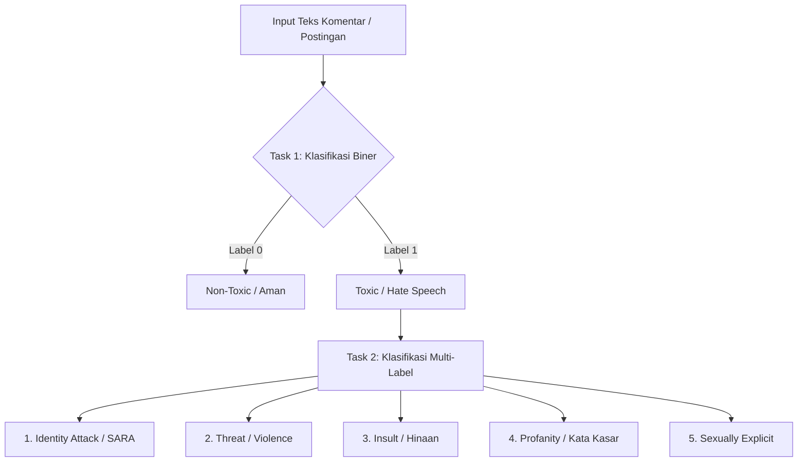

# Panduan Komprehensif Data Understanding: Indonesian Hate Speech & Toxicity Analyzer

Dokumen ini disusun sebagai panduan pemahaman masalah (*problem understanding*), kamus variabel (*data dictionary*), dan arsitektur struktur data bagi seluruh anggota tim dalam proyek **Indonesian Hate Speech Analyzer** (Mata Kuliah Workshop Proyek Sistem Cerdas).

---

## 1. Problem Framing: Mengapa Proyek Ini Penting?

### Latar Belakang Proyek
Pertumbuhan pengguna media sosial di Indonesia (Twitter/X, Facebook, Instagram, TikTok) diiringi dengan peningkatan ujaran kebencian (*hate speech*), kata-kata kasar (*profanity*), polarisasi politik, dan serangan berbasis identitas/SARA (suku, agama, ras, dan disabilitas). Fenomena ini menjadi masalah serius yang mengancam harmoni sosial, sehingga diperlukan sistem cerdas yang mampu mendeteksi teks toksik secara otomatis.

### Latar Belakang Dataset (IndoDiscourse / IndoToxic2024)
Sesuai dengan *paper* riset aslinya yang berjudul *"A Multi-Labeled Dataset for Indonesian Discourse: Examining Toxicity, Polarization, and Demographics Information"* (Susanto et al., 2025), dataset yang digunakan dalam proyek ini direkam secara historis pada periode **September 2023 – Januari 2024**. 

Tujuan utama para peneliti (*authors*) membuat dataset ini adalah untuk menganalisis **polarisasi sosial dan ujaran kebencian di Indonesia dalam konteks Pemilihan Presiden 2024**. Oleh karena itu, wajar jika Anda akan menemukan banyak sampel data yang mengandung sentimen politik, keberadaan kolom khusus `related_to_election_2024`, serta pendataan pilihan presiden (Anies/Prabowo/Ganjar) dari para annotator. Dataset ini didesain secara spesifik sebagai media eksperimen untuk melihat relasi toksisitas dan iklim politik.

### Tantangan Pemrosesan Teks Bahasa Indonesia
1. **Bahasa Tidak Baku & Slang**: Teks media sosial dipenuhi singkatan (e.g., *yg, gak, bgt, tdk, dkk*), kata gaul (*alay/slang*), dan tipografi sengaja untuk menghindari filter kata (*censorship evasion*).
2. **Konteks Budaya & Sarkasme**: Ujaran kebencian sering kali disampaikan secara implisit, satir, atau menggunakan metafora kontekstual lokal yang sulit dideteksi hanya dengan pencocokan kata kunci (*lexicon-based*).
3. **Subjektivitas Anotator**: Persepsi seseorang terhadap toksisitas sangat dipengaruhi oleh latar belakang demografi (agama, etnis, usia, preferensi politik).
4. **Ketimpangan Kelas Ekstrem (*Class Imbalance*)**: Sebagian besar teks di media sosial adalah teks non-toksik (>85%), sedangkan ujaran kebencian yang berbahaya merupakan kelas minoritas (<10%).

---

## 2. Definisi Tugas & Target Klasifikasi

Sistem dirancang untuk menyelesaikan dua tingkat klasifikasi:



### A. Task Utama: Klasifikasi Biner (`toxicity`)
- **`0` (Non-Toxic)**: Teks opini wajar, diskusi netral, berita, atau kritik sopan tanpa unsur kebencian.
- **`1` (Toxic)**: Teks yang mengandung ujaran kebencian, makian, hinaan, ancaman, pelecehan, atau konten merugikan.

### B. Task Lanjutan: Klasifikasi Multi-Label (5 Sub-Kategori Toksisitas)
Satu teks yang toksik bisa memiliki lebih dari satu kategori label sekaligus:
1. **`identity_attack`**: Serangan kebencian, perendahan, atau diskriminasi terhadap kelompok identitas tertentu (agama, etnis, ras, disabilitas, orientasi seksual).
2. **`threat_incitement_to_violence`**: Pernyataan niat atau ajakan melakukan kekerasan fisik, pembunuhan, atau perusakan terhadap individu/kelompok.
3. **`insults`**: Cercaan, hinaan yang menyerang harga diri, kecerdasan, atau fisik seseorang/kelompok.
4. **`profanity_obscenity`**: Penggunaan kata makian kotor, umpatan vulgar, atau bahasa yang dianggap tabu secara sosial.
5. **`sexually_explicit`**: Konten atau komentar berbau seksual vulgar, cabul, atau pelecehan seksual verbal.

---

## 3. Kamus Lengkap Variabel Dataset (Data Dictionary)

Dataset terdiri dari 2 file utama di dalam direktori `data/raw/`:
1. **`indotoxic2024_annotated_data_v2_final.csv`** (Dataset Teks & Anotasi Label)
2. **`indotoxic2024_annotator_demographic_data_v2_final.csv`** (Dataset Profil Demografi 29 Annotator)

### Tabel 1: Kamus Variabel Dataset Teks Utama (`indotoxic2024_annotated_data_v2_final.csv`)

| No | Nama Kolom / Variabel | Tipe Data Asli | Tipe Data Parsed | Nilai yang Mungkin | Peran dalam Pipeline ML | Deskripsi & Contoh |
|:---:|---|---|---|---|---|---|
| 1 | `text_id` | String | String | `"1-1"`, `"1-100"`, dll. | **Identifier** | ID unik untuk melacak setiap baris teks. |
| 2 | `annotators_id` | String | List of Strings | `"['7', '15']"`, `"['10', '18']"` | **Metadata Anotator** | Daftar ID annotator yang menilai teks ini (berelasi dengan data demografi). |
| 3 | `text` | String | String | Teks berbahasa Indonesia | **Fitur Utama ($X$)** | Konten teks postingan media sosial / komentar yang akan dianalisis model. |
| 4 | `initial_paragraph` | String | String / NaN | Teks konteks atau `NaN` (hanya 1.669 terisi) | **Fitur Konteks Tambahan** | Paragraf pembuka / konteks jika teks diambil dari artikel berita panjang. |
| 5 | `topic` | String | String | `"Disabilitas"`, `"Tionghoa"`, `"Jewish"`, `"Rohingya"`, `"UNKNOWN"`, dll. | **Fitur Metadata / Analisis Sub-Domain** | Kategori isu sensitif yang dibahas dalam teks. |
| 6 | `toxicity` | String | List of Strings | `"['0', '0']"`, `"['1', '0']"`, `"['1', '1']"` | **Target Task Utama ($Y_{biner}$)** | Nilai `1` = Toksik / Ujaran Kebencian, `0` = Non-toksik. |
| 7 | `identity_attack` | String | List of Strings | `"['0', '0']"`, `"['1', '0']"`, `"['1', '1']"` | **Target Task Multi-Label ($Y_{multi, 1}$)** | Nilai `1` jika teks menyerang SARA/identitas kelompok. |
| 8 | `threat_incitement_to_violence` | String | List of Strings | `"['0', '0']"`, `"['1', '0']"`, `"['1', '1']"` | **Target Task Multi-Label ($Y_{multi, 2}$)** | Nilai `1` jika teks memuat ancaman/ajakan kekerasan fisik. |
| 9 | `insults` | String | List of Strings | `"['0', '0']"`, `"['1', '0']"`, `"['1', '1']"` | **Target Task Multi-Label ($Y_{multi, 3}$)** | Nilai `1` jika teks memuat cercaan, cemooh, hinaan personal/kelompok. |
| 10 | `profanity_obscenity` | String | List of Strings | `"['0', '0']"`, `"['1', '0']"`, `"['1', '1']"` | **Target Task Multi-Label ($Y_{multi, 4}$)** | Nilai `1` jika teks menggunakan makian/kata-kata kotor. |
| 11 | `sexually_explicit` | String | List of Strings | `"['0', '0']"`, `"['1', '0']"`, `"['1', '1']"` | **Target Task Multi-Label ($Y_{multi, 5}$)** | Nilai `1` jika teks mengandung muatan seksual vulgar / cabul. |
| 12 | `polarized` | String | List of Strings | `"['0', '0']"`, `"['1', '1']"` | **Fitur Tambahan / Pembantu** | Nilai `1` jika diskursus memicu/mengandung polarisasi pandangan sosial-politik. |
| 13 | `related_to_election_2024` | String | List of Strings | `"['0', '0']"`, `"['1', '1']"` | **Fitur Metadata Konteks** | Nilai `1` jika teks berkaitan dengan topik Pemilu Presiden 2024. |
| 14 | `is_noise_or_spam_text` | String | List of Strings | `"['0', '0']"`, `"['1', '1']"` | **Filter Data (Data Cleaning)** | Nilai `1` jika teks merupakan iklan, spam bot, teks rusak, atau tidak bermakna. |

---

### Tabel 2: Kamus Variabel Dataset Profil Annotator (`indotoxic2024_annotator_demographic_data_v2_final.csv`)

| No | Nama Kolom | Tipe Data | Nilai yang Mungkin | Peran dalam Proyek |
|:---:|---|---|---|---|
| 1 | `annotator_id` | Integer / String | `1` hingga `29` | **Primary Key** (relasi ke `annotators_id` pada dataset utama). |
| 2 | `ethnicity` | String | Sunda (4), Tionghoa (3), Bugis (3), Minang (3), Jawa (2), Bali (3), Aceh (2), Batak (2), Arab, Madura, Dayak, Melayu, Ternate, Sasak, Tobelo. | Analisis bias demografi & representasi budaya. |
| 3 | `religion` | String | Islam (18), Hindu (3), Kristen (2), Katolik (2), Kepercayaan Lokal (1), Syiah (1), Ahmadiyah (1), Buddha (1). | Analisis persepsi isu keagamaan/SARA. |
| 4 | `gender` | String | `F` (Perempuan: 17), `M` (Laki-laki: 12). | Analisis bias gender terhadap toksisitas/pelecehan. |
| 5 | `age` | Integer | Rentang umur 19 hingga 55+ tahun. | Pengelompokan generasi (Gen Z, Milenial, Gen X). |
| 6 | `domisili` | String | Kota/Provinsi domisili annotator. | Representasi geografis wilayah Indonesia. |
| 7 | `pendidikan terakhir` | String | S1 (12), SMA (8), S2 (6), Diploma (2), S3 (1). | Tingkat literasi & pendidikan penilai. |
| 8 | `status pekerjaan` | String | Bekerja (18), Pelajar/Mahasiswa (8), Tidak Bekerja (2), Ibu Rumah Tangga (1). | Latar belakang aktivitas sosial-ekonomi penilai. |
| 9 | `president vote leaning` | String / Integer | `1` (Anies-Imin), `2` (Prabowo-Gibran), `3` (Ganjar-Mahfud), `"Tidak ada"`. | Variabel analisis bias polarisasi politik. |
| 10 | `disability` | String | `"Tidak"`, `"Ya"` | Representasi perspektif kelompok disabilitas. |
| 11 | `lgbt` | String | `"Tidak"`, `"Ya"` | Representasi perspektif kelompok minoritas gender/seksual. |

---

## 4. Struktur Data: Mengapa Format Anotasi Berupa List?

Pada data mentah CSV, semua kolom label tersimpan sebagai string representasi list, contoh:
```text
text_id: "1-100"
annotators_id: "['7', '15']"
text: "Gini aja deh @KPU_ID usul aja nih..."
toxicity: "['1', '0']"
insults: "['1', '0']"
```

### Mengapa Berbentuk List?
Karena satu teks dinilai oleh **lebih dari 1 annotator** secara independen:
- Annotator ID `7` memberi label `1` (Toksik).
- Annotator ID `15` memberi label `0` (Non-toksik).

### Mekanisme Agregasi Konsensus (*Majority Voting*):
Untuk mengubah list anotasi menjadi satu label biner untuk melatih model:
$$\text{Label Konsensus} = \begin{cases} 1, & \text{jika } \frac{\sum \text{vote}}{N} > 0.5 \\ 0, & \text{jika } \frac{\sum \text{vote}}{N} < 0.5 \\ \text{Disagreement / Tie (0.5)}, & \text{jika } \frac{\sum \text{vote}}{N} = 0.5 \end{cases}$$

Contoh Kasus:
* `['1', '1']` $\rightarrow$ Rata-rata 1.0 (> 0.5) $\rightarrow$ **Label 1**
* `['0', '0']` $\rightarrow$ Rata-rata 0.0 (< 0.5) $\rightarrow$ **Label 0**
* `['1', '1', '0']` $\rightarrow$ Rata-rata 0.67 (> 0.5) $\rightarrow$ **Label 1**
* `['1', '0']` $\rightarrow$ Rata-rata 0.5 $\rightarrow$ **Disagreement (Tie)** $\rightarrow$ *Strategi standar: di-drop dari data latih atau dipisahkan untuk analisis ambiguitas.*

---

## 5. Distribusi & Statistik Kritis Variabel

Berdasarkan hasil kalkulasi empiris pada seluruh 28.448 baris data:

| Variabel | Jumlah Kelas 0 | Jumlah Kelas 1 | Jumlah Disagreement | Rasio Imbalance |
|---|:---:|:---:|:---:|:---:|
| **`toxicity` (Task Utama)** | **24.453 (86.0%)** | **2.156 (7.6%)** | **1.839 (6.5%)** | **1 : 11** |
| `polarized` | 21.906 (77.0%) | 3.811 (13.4%) | 2.731 (9.6%) | 1 : 6 |
| `identity_attack` | 26.692 (93.8%) | 783 (2.8%) | 973 (3.4%) | 1 : 34 |
| `insults` | 26.501 (93.2%) | 749 (2.6%) | 1.198 (4.2%) | 1 : 35 |
| `profanity_obscenity` | 27.779 (97.6%) | 261 (0.9%) | 408 (1.4%) | 1 : 106 |
| `threat_incitement_to_violence` | 27.662 (97.2%) | 88 (0.3%) | 698 (2.5%) | 1 : 314 |
| `sexually_explicit` | 28.326 (99.6%) | 50 (0.2%) | 72 (0.3%) | 1 : 566 |
| `is_noise_or_spam_text` | 26.166 (92.0%) | 1.371 (4.8%) | 911 (3.2%) | 1 : 19 |
| `related_to_election_2024` | 25.587 (89.9%) | 1.932 (6.8%) | 929 (3.3%) | 1 : 13 |

---


