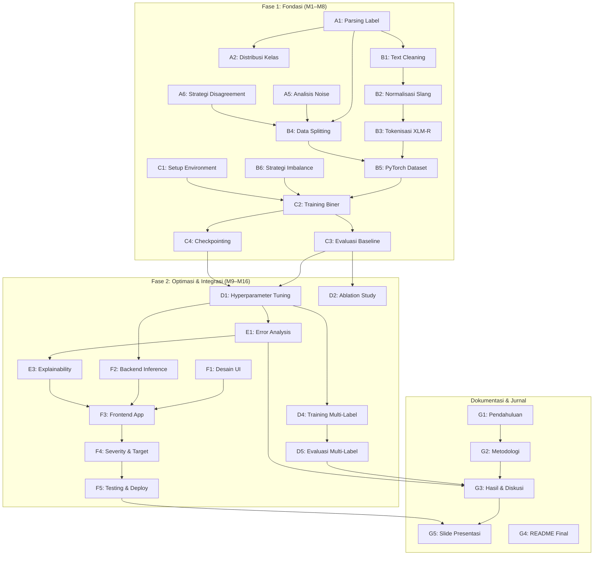

# Analisis Proyek & Pembagian Tugas — Kelompok 6

## 📋 Ringkasan Proyek

| Aspek | Detail |
|---|---|
| **Mata Kuliah** | Workshop Proyek Sistem Cerdas |
| **Dosen** | Dr. Selvia Ferdiana Kusuma, M.Kom |
| **Kelompok** | Kelompok 6 (5 anggota) |
| **Metode** | Transformer — **XLM-RoBERTa** |
| **Dataset** | `indotoxic2024` (IndoDiscourse) — 28.448 baris teks media sosial berbahasa Indonesia |
| **Repositori** | [hate-speech-analyzer](file:///d:/ARFI/Kuliah/Project/project-semester5/hate-speech-analyzer) |

---

## 🔍 Analisis Kondisi Proyek Saat Ini

### Tantangan Sementara yang Saat Ini Teridentifikasi yang Akan Dihadapi

Berdasarkan analisis [Data_Understanding_Guide.md](file:///d:/ARFI/Kuliah/Project/project-semester5/hate-speech-analyzer/docs/Data_Understanding_Guide.md):

1. **Format Data Unik** — Label anotasi tersimpan sebagai *string representasi list* (e.g., `"['1', '0']"`), bukan nilai tunggal. Perlu parsing dan agregasi konsensus (*majority voting*).
2. **Class Imbalance Ekstrem** — Rasio `toxicity` = 1:11, label multi-label lain jauh lebih parah (hingga 1:566 untuk `sexually_explicit`).
3. **Teks Bahasa Indonesia Informal** — Slang, singkatan, sarkasme, dan *censorship evasion* pada teks media sosial.
4. **Dua Tingkat Klasifikasi** — Task biner (Toxic vs Non-toxic) DAN task multi-label (5 sub-kategori).
5. **Handling Disagreement** — 6.5% data `toxicity` berstatus *disagreement* (rata-rata vote = 0.5).

---

## 📌 Identifikasi Seluruh Tugas Proyek

Berikut adalah **dekomposisi lengkap** semua pekerjaan yang harus diselesaikan, dikelompokkan per fase sesuai roadmap M1–M16.

---

### Fase 1: Fondasi & Pembuktian Awal (M1–M8, Target UTS)

#### A. Data Understanding & EDA (Eksplorasi Data)

| ID | Tugas | Detail Pekerjaan | Deliverable |
|:---:|---|---|---|
| A1 | **Parsing format data** | Mengubah kolom label dari string list (`"['1','0']"`) menjadi Python list, lalu menghitung rata-rata vote per baris untuk mendapatkan label konsensus via *majority voting* | Script/notebook preprocessing awal |
| A2 | **Analisis distribusi kelas** | Menghitung & memvisualisasikan distribusi label `toxicity` (biner) dan 5 sub-label multi-label, termasuk jumlah *disagreement* per label | Grafik bar chart, pie chart distribusi |
| A3 | **Analisis distribusi teks** | Statistik panjang teks (karakter & kata), distribusi per topik (`topic`), wordcloud kata paling sering muncul pada kelas toxic vs non-toxic | Notebook EDA + visualisasi |
| A4 | **Analisis korelasi antar label** | Heatmap korelasi antar label multi-label (misal: apakah `insults` sering muncul bersamaan dengan `profanity`?) | Heatmap korelasi |
| A5 | **Analisis data noise/spam** | Memeriksa baris yang ditandai `is_noise_or_spam_text` = 1, memutuskan strategi penanganan (drop atau pertahankan) | Keputusan & dokumentasi |
| A6 | **Strategi penanganan disagreement** | Menentukan perlakuan untuk baris dengan vote = 0.5: di-drop, diberi label 0, atau dipisahkan untuk analisis terpisah | Keputusan & dokumentasi |

---

#### B. Data Preprocessing & Feature Engineering

| ID | Tugas | Detail Pekerjaan | Deliverable |
|:---:|---|---|---|
| B1 | **Text cleaning** | Membersihkan teks: lowercasing, menghapus URL, mention (@user), hashtag, emoji, karakter non-alfanumerik ganda, whitespace berlebih | Fungsi `clean_text()` yang reusable |
| B2 | **Normalisasi kata tidak baku** | Menyusun kamus normalisasi singkatan/slang Bahasa Indonesia (e.g., "yg" → "yang", "gak" → "tidak", "bgt" → "banget") | File kamus + fungsi `normalize_text()` |
| B3 | **Tokenisasi XLM-RoBERTa** | Mengimplementasikan tokenisasi menggunakan `AutoTokenizer` dari HuggingFace untuk model `xlm-roberta-base` atau `xlm-roberta-large`, menentukan `max_length` yang optimal | Script tokenisasi |
| B4 | **Pembagian dataset (Data Splitting)** | Membagi data menjadi Train / Validation / Test split (misal 70/15/15 atau 80/10/10), memastikan stratified split agar proporsi kelas terjaga | Script split + file data train/val/test |
| B5 | **Pembuatan Dataset class PyTorch** | Membuat custom `torch.utils.data.Dataset` class yang meng-handle tokenisasi + label untuk dipakai oleh DataLoader | File `dataset.py` |
| B6 | **Strategi penanganan imbalance** | Implementasi minimal 2 dari: (a) class-weight balancing, (b) focal loss, (c) oversampling/undersampling, (d) augmentasi data teks | Kode + dokumentasi perbandingan |

---

#### C. Baseline & Model Training Tahap 1

| ID | Tugas | Detail Pekerjaan | Deliverable |
|:---:|---|---|---|
| C1 | **Setup environment & dependencies** | Menyiapkan `requirements.txt`, memastikan kompatibilitas versi PyTorch + Transformers + CUDA (jika GPU) | File `requirements.txt` |
| C2 | **Pipeline training klasifikasi biner** | Membangun pipeline *fine-tuning* XLM-RoBERTa untuk Task Utama (binary: toxic vs non-toxic) dengan konfigurasi baseline (default hyperparameter) | Notebook/script training |
| C3 | **Evaluasi baseline** | Menghitung metrik wajib pada test set: Macro-F1, Precision, Recall, Confusion Matrix | Hasil metrik + visualisasi |
| C4 | **Checkpointing & reprodusibilitas** | Menyimpan model weights (`model.safetensors`/`.pt`), mencatat random seed, dan memastikan hasil bisa direproduksi | Config file + saved model |

---

### Fase 2: Optimasi & Integrasi Sistem (M9–M16, Target UAS)

#### D. Eksperimen Lanjutan & Hyperparameter Tuning

| ID | Tugas | Detail Pekerjaan | Deliverable |
|:---:|---|---|---|
| D1 | **Hyperparameter tuning** | Eksperimen sistematis: learning rate (1e-5, 2e-5, 3e-5, 5e-5), batch size (8, 16, 32), jumlah epochs, warm-up steps | Tabel hasil eksperimen |
| D2 | **Ablation study** | Membandingkan performa: (a) baseline tanpa teknik apapun, (b) + class weight, (c) + focal loss, (d) + augmentasi. Dokumentasi dampak tiap teknik | Tabel komparasi ablation |
| D3 | **Perbandingan varian model** | Eksperimen `xlm-roberta-base` vs `xlm-roberta-large` (jika resource memungkinkan), analisis trade-off performa vs komputasi | Hasil perbandingan |
| D4 | **Pipeline training multi-label** | Memperluas model untuk Task Lanjutan: klasifikasi multi-label (5 sub-kategori toksisitas secara simultan) | Script training multi-label |
| D5 | **Evaluasi multi-label** | Metrik per-label (F1, precision, recall) + metrik agregat, analisis label mana yang paling sulit dideteksi | Tabel & grafik evaluasi multi-label |

---

#### E. Error Analysis & Explainability

| ID | Tugas | Detail Pekerjaan | Deliverable |
|:---:|---|---|---|
| E1 | **Error analysis mendalam** | Menganalisis sampel yang salah prediksi: false positive & false negative, pola kesalahan berdasarkan topik/panjang teks/tipe toksisitas | Tabel & narasi error analysis |
| E2 | **Analisis per topik/domain** | Membandingkan performa model per kategori `topic` (Disabilitas, Tionghoa, Agama, dll.) | Breakdown metrik per topik |
| E3 | **Token-level explainability** | Implementasi *attention visualization* atau *token attribution* (e.g., menggunakan attention weights XLM-RoBERTa atau library SHAP/LIME) untuk menunjukkan kata yang memicu prediksi | Visualisasi highlight token |

---

#### F. Pengembangan Prototype Aplikasi

| ID | Tugas | Detail Pekerjaan | Deliverable |
|:---:|---|---|---|
| F1 | **Desain UI/UX** | Merancang layout antarmuka: input teks, tombol analisis, area output (label, confidence, severity, highlight) | Wireframe/mockup UI |
| F2 | **Implementasi backend inference** | Membangun fungsi inference yang memuat model terlatih, menerima teks input, dan mengembalikan prediksi + probabilitas | File `inference.py` / `predict.py` |
| F3 | **Implementasi frontend Streamlit/Gradio** | Membangun aplikasi web interaktif: input teks → prediksi label → confidence score → severity level → token highlighting | File `app.py` |
| F4 | **Fitur severity & target** | Logika pemetaan confidence score ke level severity (Low/Medium/High) dan deteksi target (Individual/Group) | Integrasi dalam `app.py` |
| F5 | **Testing & deployment lokal** | Memastikan aplikasi berjalan lancar secara lokal, debug edge cases, optimasi kecepatan inference | Aplikasi yang siap demo |

---

#### G. Dokumentasi & Laporan Jurnal

| ID | Tugas | Detail Pekerjaan | Deliverable |
|:---:|---|---|---|
| G1 | **Penulisan bagian Pendahuluan & Latar Belakang** | Menulis konteks masalah, motivasi, dan kontribusi proyek dalam format jurnal ilmiah | Bab 1 jurnal |
| G2 | **Penulisan bagian Metodologi** | Dokumentasi arsitektur XLM-RoBERTa, preprocessing pipeline, strategi training, dan konfigurasi eksperimen | Bab Metode jurnal |
| G3 | **Penulisan bagian Hasil & Diskusi** | Menyajikan seluruh tabel metrik evaluasi, grafik perbandingan, ablation study, dan error analysis | Bab Hasil jurnal |
| G4 | **Finalisasi README & dokumentasi GitHub** | Memperbarui README.md dengan instruksi lengkap: setup, run training, run app. Memastikan `requirements.txt` akurat | README final |
| G5 | **Pembuatan materi presentasi** | Slide presentasi untuk UTS (M8) dan UAS (M16) | File slide presentasi |

---

## 👥 Pembagian Tugas untuk 5 Anggota

Berdasarkan identifikasi **32 tugas** di atas, berikut pembagian yang mempertimbangkan keseimbangan beban kerja dan ketergantungan antar tugas:

### Anggota 1 — *Data Engineer*
**Fokus: Kualitas data dari mentah hingga siap latih**

| Fase | Tugas yang Ditangani |
|---|---|
| Fase 1 | A1, A2, A3, A5, A6, B1, B2 |
| Fase 2 | E2 (bantu analisis per topik) |
| Pendukung | G4 (kontribusi dokumentasi data di README) |

**Rincian:**
- Parsing label list → majority voting → label konsensus
- Seluruh EDA (distribusi kelas, distribusi teks, noise analysis)
- Text cleaning & normalisasi slang Indonesia
- Keputusan strategi penanganan disagreement & noise
- Ikut menulis bagian deskripsi data di jurnal

---

### Anggota 2 — *ML Engineer (Model Builder)*
**Fokus: Arsitektur model, training pipeline, dan reprodusibilitas**

| Fase | Tugas yang Ditangani |
|---|---|
| Fase 1 | B3, B4, B5, C1, C2, C4 |
| Fase 2 | D3, D4 |
| Pendukung | G2 (kontribusi penulisan metodologi) |

**Rincian:**
- Tokenisasi XLM-RoBERTa & pembuatan PyTorch Dataset class
- Data splitting (stratified)
- Setup environment (`requirements.txt`)
- Pipeline fine-tuning XLM-RoBERTa untuk klasifikasi biner
- Pipeline fine-tuning untuk klasifikasi multi-label (Fase 2)
- Eksperimen perbandingan `xlm-roberta-base` vs `xlm-roberta-large`
- Checkpointing, random seed, reprodusibilitas

---

### Anggota 3 — *ML Engineer ke-2 (Evaluator & Optimizer)*
**Fokus: Performa model, tuning, dan analisis mendalam**

| Fase | Tugas yang Ditangani |
|---|---|
| Fase 1 | A4, B6, C3 |
| Fase 2 | D1, D2, D5, E1, E3 |
| Pendukung | G3 (kontribusi penulisan hasil & diskusi) |

**Rincian:**
- Analisis korelasi antar label
- Implementasi strategi penanganan imbalance (class-weight, focal loss, augmentasi)
- Evaluasi baseline + evaluasi multi-label
- Hyperparameter tuning sistematis
- Ablation study lengkap
- Error analysis mendalam (false positive/negative patterns)
- Token-level explainability (attention visualization / SHAP)

---

### Anggota 4 — *System Developer / UI Developer*
**Fokus: Membangun aplikasi prototype interaktif end-to-end**

| Fase | Tugas yang Ditangani |
|---|---|
| Fase 2 | F1, F2, F3, F4, F5 |
| Pendukung | G4 (kontribusi dokumentasi cara menjalankan app), G5 (bantu slide demo) |

**Rincian:**
- Desain wireframe UI/UX
- Implementasi fungsi inference (load model → prediksi)
- Membangun aplikasi Streamlit/Gradio lengkap
- Fitur severity mapping & token highlighting di UI
- Testing, debugging, dan optimasi kecepatan inference
- Dokumentasi cara deploy/run aplikasi

> [!TIP]
> Anggota 4 akan lebih sibuk di Fase 2 (M9–M16). Selama Fase 1 (M1–M8), anggota ini bisa membantu Anggota 1 (EDA) atau Anggota 2 (setup environment), dan mulai riset/prototyping awal UI.

---

### Anggota 5 — *Technical Writer & Project Manager*
**Fokus: Koordinasi tim, dokumentasi, dan penulisan jurnal**

| Fase | Tugas yang Ditangani |
|---|---|
| Seluruh Fase | G1, G2, G3, G4, G5 |
| Pendukung | A6 (bantu keputusan strategi), D2 (bantu dokumentasi ablation) |

**Rincian:**
- Mengelola repositori GitHub (branch, PR, commit history)
- Memimpin penulisan jurnal ilmiah (Pendahuluan, Metodologi, Hasil & Diskusi)
- Memastikan README.md selalu up-to-date
- Membuat materi presentasi UTS dan UAS
- Memantau progres roadmap (M1–M16) dan koordinasi antar anggota
- Memastikan checklist rilis final terpenuhi (seed tercatat, metrik lengkap, demo lancar)

> [!TIP]
> Anggota 5 juga berperan sebagai *penghubung* antar anggota lain. Misalnya, mengumpulkan hasil evaluasi dari Anggota 3, narasi metodologi dari Anggota 2, dan screenshot app dari Anggota 4 untuk dijadikan konten jurnal.

---

## 📊 Ringkasan Distribusi Beban Kerja

| Anggota | Role | Jumlah Tugas Utama | Fase Paling Sibuk |
|:---:|---|:---:|---|
| 1 | Data Engineer | 9 | Fase 1 (M1–M8) |
| 2 | ML Engineer | 9 | Fase 1–2 (M3–M11) |
| 3 | ML Engineer ke-2 | 10 | Fase 2 (M5–M13) |
| 4 | System Developer / UI Developer | 7 | Fase 2 (M12–M16) |
| 5 | Technical Writer & PM | 7 | Merata (sepanjang proyek) |

---

## 🔗 Diagram Ketergantungan Antar Tugas

> [!IMPORTANT]
> **Jalur kritis terpanjang**: A1 → B1 → B2 → B3 → B5 → C2 → C3 → D1 → D4 → D5 → G3 → G5.
> Keterlambatan di jalur ini akan langsung menggeser deadline keseluruhan. Prioritaskan tugas-tugas pada jalur ini.

---

## 🤝 Catatan Fleksibilitas Tim

> [!NOTE]
> **Dokumen ini dirancang sebagai kerangka kerja awal (guideline), bukan aturan kaku yang tidak bisa diubah.**
> Sangat wajar jika ke depannya terjadi pergeseran peran, penyesuaian beban kerja, atau perubahan strategi eksperimen. Semua anggota tim diharapkan bersikap **fleksibel, saling mem-backup jika ada anggota yang menghadapi kendala (bottleneck)**, dan senantiasa menyesuaikan diri dengan kondisi riil proyek atau masukan terbaru dari dosen pengampu.
