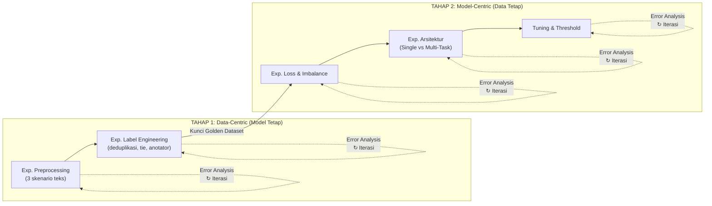
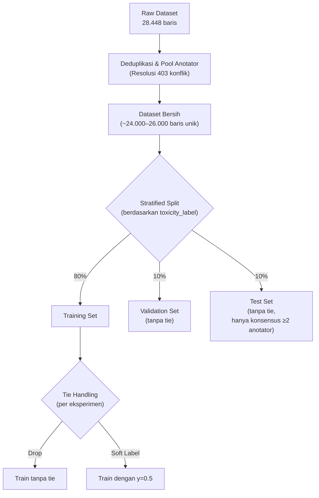
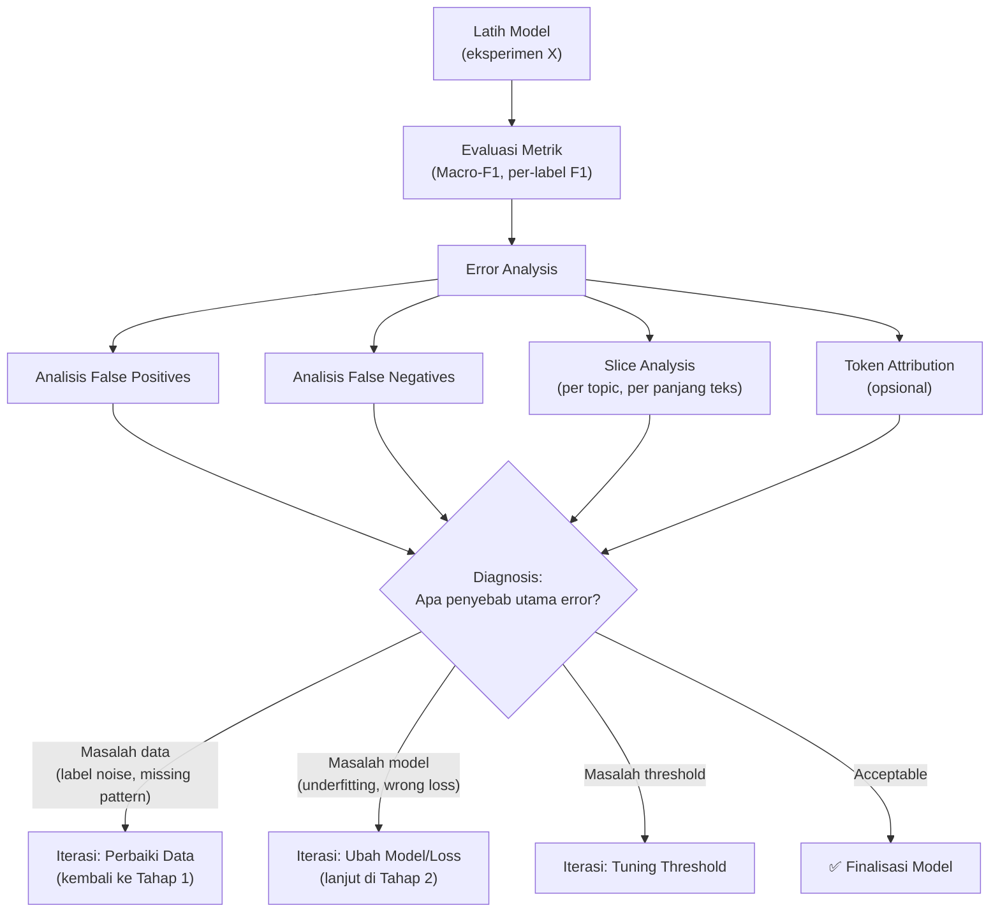

# Desain Eksperimen & Pipeline ML: XLM-RoBERTa

**Proyek:** Indonesian Hate Speech Analyzer — Kelompok 6  
**Model Target:** `xlm-roberta-base`  
**Dataset:** IndoToxic2024 (28.448 teks, 9 label, multi-annotator)  
**Acuan:** Susanto et al. (2025), *Findings of ACL 2025*

Dokumen ini merancang alur eksperimen secara bertahap (*phased*) menggunakan pendekatan **Data-Centric AI**: perbaiki data terlebih dahulu dengan arsitektur model konstan, baru kemudian optimalkan model pada data terbaik. **Error Analysis** diposisikan sebagai **alat iteratif** di setiap akhir tahap untuk menginformasikan keputusan tahap berikutnya.

---

## Filosofi Eksperimen



> [!IMPORTANT]
> **Prinsip Utama:** Setiap akhir eksperimen, jalankan **Error Analysis** (Bagian 6) untuk memahami *mengapa* model gagal. Temuan error analysis menjadi dasar keputusan iterasi berikutnya — bukan sekadar laporan akhir.

---

## Baseline Model (Konstan untuk Tahap 1)

Seluruh eksperimen Tahap 1 menggunakan konfigurasi model yang **tidak boleh diubah**, agar perbedaan performa murni disebabkan oleh perlakuan data:

| Parameter | Nilai | Alasan |
|:---|:---|:---|
| Model | `xlm-roberta-base` | Standar, cukup kuat, hemat VRAM |
| Classification Head | 1 Linear Layer + Sigmoid | Seminimal mungkin |
| Learning Rate | $2 \times 10^{-5}$ | Default yang stabil untuk fine-tuning Transformer |
| Batch Size | 16 | Standar paper IndoToxic2024 |
| Max Length | 256 tokens | Mencakup >96% teks utuh (P95 = 174 kata) |
| Epochs | 3 | Cukup untuk konvergensi pada fine-tuning |
| Loss | `BCEWithLogitsLoss` (tanpa weight) | Naive baseline, tanpa trik apapun |
| Threshold | 0.5 | Default, belum di-tuning |
| Scheduler | Linear warmup (10% steps) | Standar |
| Evaluasi | Macro-F1 pada Validation Set | Metrik utama |

---

## TAHAP 1: Eksperimen Data-Centric (Model Tetap)

### 1.1 Eksperimen Preprocessing Teks

**Tujuan:** Menentukan fungsi pembersihan teks optimal untuk XLM-RoBERTa pada teks media sosial Indonesia.

**Hipotesis:** Preprocessing minimal (hanya masking noise) akan mengungguli heavy cleaning karena XLM-RoBERTa membutuhkan konteks utuh termasuk casing, stopwords, dan tanda baca sebagai sinyal linguistik.

| ID | Skenario | Operasi | Hipotesis |
|:---:|:---|:---|:---|
| P-A | **Raw Text** (Kontrol) | Tidak ada perubahan. Teks mentah langsung ke tokenizer. | Baseline batas bawah |
| P-B | **Classic Heavy Cleaning** | Lowercase + hapus tanda baca + hapus angka + hapus emoji + hapus stopwords | **Performa terburuk** — menghilangkan sinyal casing, negasi, dan emosi |
| P-C | **Minimal Transformer Cleaning** | Mask URL → `[URL]`, Mask mention → `[USER]`, normalisasi repetisi `(.)\1{2,}` → `\1\1`, trim spasi | **Performa terbaik** — membuang noise tanpa merusak sinyal |

**Bukti EDA yang mendasari hipotesis:**
- **Anti-lowercase:** 27–37% teks mengandung `[A-Z]{4,}` — huruf kapital berlebihan sebagai sinyal agresi
- **Anti-stopword removal:** >11.000 kemunculan kata negasi (`tidak`, `bukan`, `gak`, `jangan`) — menghapusnya membalikkan makna kalimat
- **Pro-masking URL/mention:** URL (2–3%) dan mention (9–14%) adalah noise yang memicu spurious correlation
- **Pro-normalisasi repetisi:** Tanda baca berlebih (`!?.,` $\ge 3\times$) 3× lebih tinggi di teks toksik — normalisasi membantu subword recognition tanpa menghilangkan sinyal emosi

**Implementasi Skenario P-C:**
```python
import re

def preprocess_transformer(text: str) -> str:
    if not isinstance(text, str):
        return ""
    text = re.sub(r'https?://\S+|www\.\S+', '[URL]', text)   # Mask URL
    text = re.sub(r'@\w+', '[USER]', text)                    # Mask mention
    text = re.sub(r'(.)\1{2,}', r'\1\1', text)                # Norm repetisi
    text = re.sub(r'\s+', ' ', text).strip()                   # Trim spasi
    return text
```

**Metrik perbandingan:** Macro-F1 pada validation set (3 run, rata-rata ± std).

**Output:** Satu fungsi preprocessing terpilih → dikunci untuk semua eksperimen selanjutnya.

---

### 1.2 Eksperimen Label Engineering

**Tujuan:** Menentukan racikan data terbaik dari sisi resolusi label, deduplikasi, dan kualitas anotator.

Semua eksperimen di bawah menggunakan **preprocessing terpilih dari 1.1**.

#### 1.2.1 Resolusi Duplikat & Konflik Label

**Fakta EDA:** 403 teks unik memiliki label toxicity yang saling bertentangan antar kemunculannya. Total 4.392 baris terlibat duplikasi.

| ID | Skenario | Perlakuan | Hipotesis |
|:---:|:---|:---|:---|
| D-A | **No Action** (Kontrol) | Biarkan duplikat apa adanya | Baseline; berisiko data leakage |
| D-B | **Drop Duplicates** | `drop_duplicates(subset='text', keep='first')` | Cepat tapi kehilangan informasi anotator |
| D-C | **Pool & Re-vote** | Gabungkan semua anotasi dari semua kemunculan teks yang sama, lalu hitung ulang majority vote dari pool gabungan | **Performa terbaik** — memaksimalkan jumlah anotator efektif |

> [!WARNING]
> **Wajib:** Apapun skenarionya, deduplikasi harus dilakukan **SEBELUM** train-test split untuk mencegah data leakage.

#### 1.2.2 Resolusi Tie / Disagreement (Label = 0.5)

**Fakta EDA:** `toxicity` memiliki 1.839 kasus tie (6,5%), `polarized` memiliki 2.731 (9,6%).

| ID | Skenario | Perlakuan di Training | Perlakuan di Test |
|:---:|:---|:---|:---|
| T-A | **Drop Tie** | Hapus semua baris tie dari training | Hapus dari test |
| T-B | **Soft Label** | Pertahankan sebagai target $y = 0.5$ pada `BCEWithLogitsLoss` | Hapus dari test |
| T-C | **Downweighted Soft** | Pertahankan $y = 0.5$ dengan loss weight $\times 0.5$ | Hapus dari test |

> [!NOTE]
> Test set **selalu** tanpa tie, agar evaluasi metrik (Precision/Recall/F1) dilakukan pada ground truth yang jelas.

#### 1.2.3 Penanganan Data Single-Annotator (55,36% Dataset)

**Fakta EDA:** 15.748 baris hanya dinilai 1 orang. Paper IndoToxic2024 menunjukkan model yang dilatih hanya pada single-coder → high precision (73,6%) tapi low recall (50,7%).

| ID | Skenario | Perlakuan | Hipotesis |
|:---:|:---|:---|:---|
| A-A | **Equal Weight** (Kontrol) | Semua data bobot loss sama (1.0) | Baseline |
| A-B | **Confidence Weighting** | Single-annotator: loss weight $\times 0.7$, Multi-annotator: $\times 1.0$ | Model tidak over-memorize label subjektif |
| A-C | **Curriculum Learning** | Fase 1: latih 2 epoch pada data $\ge 2$ anotator saja. Fase 2: fine-tune 1 epoch pada seluruh data dengan LR $\times 0.1$ | **Performa terbaik** — fondasi konsensus dulu, baru perkaya variasi |
| A-D | **Consensus Only** | Hanya gunakan data $\ge 2$ anotator (~12.700 baris) | Kualitas tinggi tapi kehilangan 55% variasi linguistik |

**Output Tahap 1:** Kombinasi terbaik dari preprocessing + deduplikasi + tie handling + annotator strategy → **"Golden Dataset"** yang dikunci untuk Tahap 2.

---

## TAHAP 2: Eksperimen Model-Centric (Data Tetap)

Seluruh eksperimen di bawah menggunakan **Golden Dataset** hasil Tahap 1.

### 2.1 Eksperimen Loss Function & Class Imbalance

**Fakta EDA:** Rasio imbalance biner 1:11, sub-label hingga 1:567.

| ID | Loss Function | Parameter | Hipotesis |
|:---:|:---|:---|:---|
| L-A | `BCEWithLogitsLoss` (Kontrol) | Tanpa weight | Baseline (recall rendah) |
| L-B | **Weighted BCE** | `pos_weight = N_neg / N_pos` per label | Meningkatkan recall signifikan |
| L-C | **Focal Loss** | $\gamma = 2.0$, $\alpha = 0.75$ | Mengabaikan easy negatives, fokus hard examples |
| L-D | **Asymmetric Loss (ASL)** | $\gamma_+ = 0$, $\gamma_- = 4$, clip $= 0.05$ | SOTA untuk multi-label extreme imbalance |

### 2.2 Eksperimen Arsitektur Classification Head

| ID | Arsitektur | Deskripsi | Hipotesis |
|:---:|:---|:---|:---|
| H-A | **Single Head** (Kontrol) | 1 linear layer → 6 output (1 biner + 5 sub-label) | Baseline |
| H-B | **Multi-Task Dual Head** | Head 1: binary toxicity. Head 2: 5 sub-labels. $\mathcal{L} = \mathcal{L}_{binary} + \lambda \mathcal{L}_{multi}$ | Sub-label mendapat sinyal gradien dari task biner yang data-rich |
| H-C | **Hierarchical / Conditional** | Prediksi biner dulu; sub-label hanya diprediksi jika $\hat{y}_{binary} > T^*$ | Mengurangi false positive sub-label pada teks non-toxic |

### 2.3 Tuning Hyperparameter & Threshold

Setelah loss dan arsitektur terbaik ditentukan:

| Parameter | Range Eksplorasi | Metode |
|:---|:---|:---|
| Learning Rate | $\{1 \times 10^{-5},\ 2 \times 10^{-5},\ 3 \times 10^{-5},\ 5 \times 10^{-5}\}$ | Grid search |
| Batch Size | $\{8, 16, 32\}$ | Grid search (+ gradient accumulation) |
| Max Length | $\{128, 256, 384\}$ | Grid search |
| Epochs | $\{3, 4, 5\}$ | Early stopping pada val loss |
| **Threshold (per-label)** | $T \in [0.10,\ 0.50]$ dengan step $0.05$ | Grid search pada validation set, optimasi Macro-F1 |

> [!TIP]
> **Threshold tuning adalah langkah paling murah dan paling berdampak.** Karena distribusi tiap label sangat berbeda (1:11 vs 1:567), threshold optimal `toxicity` bisa ~0.30, sementara `threat` bisa serendah ~0.15.

---

## Skema Data Split



> [!CAUTION]
> **Test Set harus berkualitas tertinggi:** Hanya berisi teks unik, tanpa tie, idealnya hanya data dengan $\ge 2$ anotator. Ini memastikan evaluasi mencerminkan kemampuan model terhadap ground truth yang valid, bukan subjektivitas individu.

---

## Error Analysis: Alat Iteratif (Bukan Langkah Terakhir)

Error Analysis **bukan** langkah akhir setelah model jadi. Ia adalah **alat diagnostik** yang dijalankan di **setiap akhir eksperimen** untuk menjawab pertanyaan: *"Mengapa model masih gagal, dan apa yang harus diubah di iterasi berikutnya?"*

### Alur Iterasi Error Analysis



### Protokol Error Analysis (Dijalankan Setiap Eksperimen)

#### Langkah 1: Klasifikasi Error

Untuk setiap model yang dilatih, kumpulkan prediksi pada validation set dan kategorikan:

| Kategori Error | Deskripsi | Contoh |
|:---|:---|:---|
| **FP - Identity Bias** | Model menuduh toksik karena kata identitas netral | *"Warga Tionghoa merayakan Imlek"* → diprediksi toxic |
| **FP - Negation Failure** | Model gagal memahami negasi | *"Saya TIDAK membenci siapapun"* → diprediksi toxic |
| **FP - Counter-speech** | Model salah pada teks yang mengutip/mengkritik hate speech | *"Kata-kata seperti 'usir mereka' itu ujaran kebencian"* → diprediksi toxic |
| **FP - Casual Profanity** | Model salah pada makian non-hate | *"Anjir lu jago banget cok"* → diprediksi toxic |
| **FN - Implicit Hate** | Model gagal pada sarkasme/satir | *"Semoga kelompok itu segera dipulangkan ke asalnya"* → diprediksi non-toxic |
| **FN - Dogwhistle** | Model gagal pada julukan politik | *"Dasar Kadrun"*, *"Cebong tolol"* → diprediksi non-toxic |
| **FN - Obfuscation** | Model gagal pada tipografi sengaja | *"4nj1ng"*, *"k4drvn"* → diprediksi non-toxic |

#### Langkah 2: Analisis Distribusi Error

| Dimensi Analisis | Cara Mengukur | Keputusan yang Diinformasikan |
|:---|:---|:---|
| **Per label** | F1 per kolom label | Apakah sub-label tertentu (mis. `threat`) butuh loss khusus? |
| **Per topic** | F1 per nilai kolom `topic` | Apakah model bias pada topik Disabilitas / Tionghoa? |
| **Per panjang teks** | F1 per bin (pendek ≤10 kata, sedang, panjang ≥100 kata) | Apakah `max_length` perlu dinaikkan? |
| **Per jumlah anotator** | F1 untuk single vs multi-annotator | Apakah single-annotator data memperburuk performa? |
| **Per tipe FP/FN** | Proporsi tiap kategori error di atas | Pola error mana yang dominan? |

#### Langkah 3: Keputusan Iterasi

| Temuan Error Analysis | Aksi Iterasi |
|:---|:---|
| FP Identity Bias dominan | → Periksa apakah data training over-represent kata identitas di kelas toxic. Pertimbangkan augmentasi data netral berisi kata identitas |
| FN Implicit Hate dominan | → Data cleaning mungkin terlalu agresif (menghapus konteks). Kembali ke preprocessing yang lebih minimal |
| Performa drop pada topik tertentu | → Periksa distribusi topik di training set. Pertimbangkan stratified sampling berbasis topic |
| Performa drop pada teks pendek | → Mayoritas teks toxic memang pendek (mean 33 kata). Pastikan tokenizer tidak menambahkan padding berlebih |
| Sub-label `threat`/`sexually_explicit` F1 ≈ 0 | → Jumlah sampel terlalu sedikit (88 dan 50). Gunakan ASL atau multi-task architecture agar mendapat gradien dari task biner |
| FP tinggi secara keseluruhan | → `pos_weight` atau threshold terlalu agresif. Turunkan weight atau naikkan threshold |
| FN tinggi secara keseluruhan | → Model terlalu konservatif. Naikkan `pos_weight` atau turunkan threshold |

### Tools Error Analysis

| Tool | Fungsi | Kapan Digunakan |
|:---|:---|:---|
| **Confusion Matrix** per label | Visualisasi TP/FP/FN/TN | Setiap eksperimen |
| **Classification Report** (`sklearn`) | Precision/Recall/F1 per kelas | Setiap eksperimen |
| **Pandas filtering** | Filter & baca sampel FP/FN secara manual | Setiap eksperimen (baca 20–50 sampel error) |
| **Behavioral Test Suite** | Kumpulan 50–100 kalimat uji buatan tangan untuk cek bias negasi, identitas, sarkasme | Setiap akhir tahap |
| **Integrated Gradients / SHAP** | Atribusi token — kata mana yang paling berpengaruh pada prediksi | Opsional, di akhir Tahap 2 |

> [!IMPORTANT]
> **Membaca sampel error secara manual adalah langkah paling penting.** Tidak ada metrik agregat yang bisa menggantikan mata manusia yang membaca 20–50 teks yang salah diklasifikasikan untuk memahami pola kegagalan.

---

## Ringkasan Urutan Eksekusi

| Urutan | Eksperimen | Variabel Berubah | Variabel Tetap | Output |
|:---:|:---|:---|:---|:---|
| 1 | Preprocessing (P-A/B/C) | Fungsi cleaning teks | Model baseline, data mentah | Fungsi preprocessing terbaik |
| 2 | Deduplikasi (D-A/B/C) | Strategi deduplikasi | Model baseline, preprocessing terpilih | Strategi dedup terbaik |
| 3 | Tie Handling (T-A/B/C) | Perlakuan label 0.5 | Model baseline, preprocessing + dedup terpilih | Strategi tie terbaik |
| 4 | Annotator Quality (A-A/B/C/D) | Perlakuan single-annotator | Model baseline, semua di atas terpilih | **Golden Dataset** |
| — | ↻ Error Analysis | — | — | Validasi Golden Dataset |
| 5 | Loss Function (L-A/B/C/D) | Loss function | Golden Dataset, arsitektur baseline | Loss terbaik |
| 6 | Architecture (H-A/B/C) | Classification head | Golden Dataset, loss terpilih | Arsitektur terbaik |
| 7 | Hyperparameter Tuning | LR, batch, max_len, epochs | Golden Dataset, loss + arsitektur terpilih | Config terbaik |
| 8 | Threshold Tuning | Per-label threshold | Semua di atas | **Model Final** |
| — | ↻ Error Analysis Final | — | — | Laporan evaluasi & bias |
