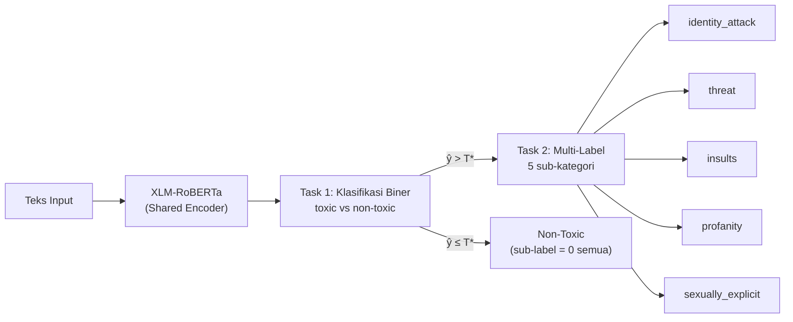
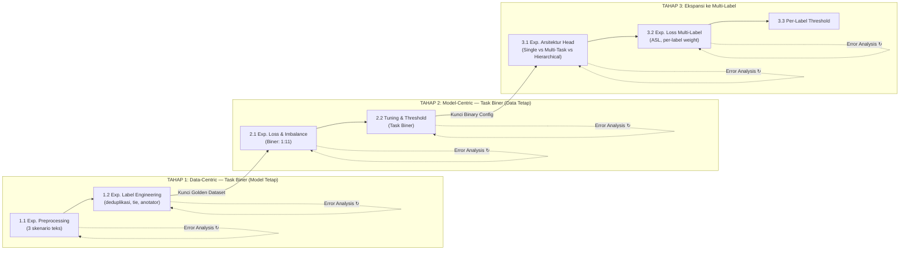
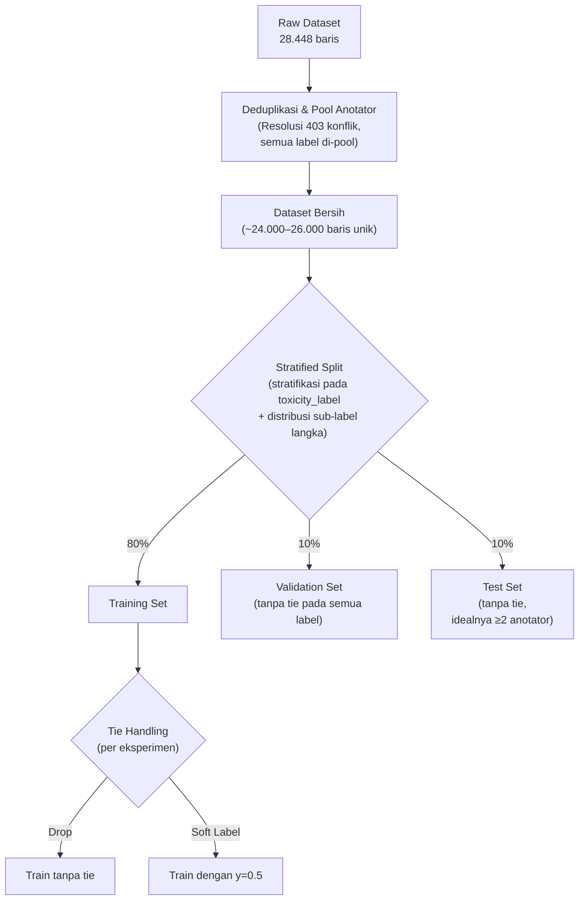
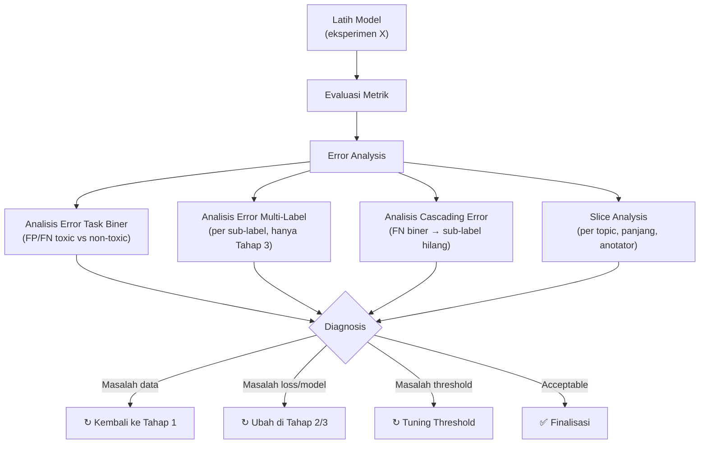

# Desain Eksperimen & Pipeline ML: XLM-RoBERTa

**Proyek:** Indonesian Hate Speech Analyzer — Kelompok 6  
**Model Target:** `xlm-roberta-base`  
**Dataset:** IndoToxic2024 (28.448 teks, 9 label, multi-annotator)  
**Acuan:** Susanto et al. (2025), *Findings of ACL 2025*

---

## Objektif Eksperimen

1. **Menemukan racikan data optimal** (preprocessing, deduplikasi, resolusi tie, strategi anotator) yang menghasilkan *ground truth* paling bersih untuk melatih model, diukur hanya pada **Task Biner (toxic vs non-toxic)** dengan arsitektur baseline konstan.
2. **Menemukan arsitektur, loss function, dan konfigurasi training terbaik** untuk Task Biner pada data yang sudah dikunci ("Golden Dataset").
3. **Memperluas model ke Task Multi-Label (5 sub-kategori toksisitas)** dengan arsitektur yang mampu menangani extreme imbalance (rasio 1:34 hingga 1:567), setelah fondasi Task Biner sudah solid.
4. **Menggunakan Error Analysis sebagai alat iteratif** di setiap akhir eksperimen untuk mendiagnosis kegagalan dan menginformasikan keputusan iterasi berikutnya — bukan sekadar laporan akhir.

> [!IMPORTANT]
> **Prinsip:** Data-Centric dulu, Model-Centric kemudian. Task Biner dulu, Multi-Label kemudian. Jangan pernah mengubah dua variabel sekaligus.

---

## Arsitektur Task: Dua Tahap Klasifikasi



Seluruh desain eksperimen di bawah disusun mengikuti hierarki task ini. **Task Biner adalah fondasi** — jika deteksi toxic/non-toxic gagal, seluruh sub-label otomatis salah (*cascading error*).

---

## Filosofi & Alur Eksperimen



---

## Baseline Model (Konstan untuk Tahap 1)

Seluruh eksperimen Tahap 1 menggunakan konfigurasi model yang **tidak boleh diubah**, agar perbedaan performa murni disebabkan oleh perlakuan data:

| Parameter | Nilai | Alasan |
|:---|:---|:---|
| Model | `xlm-roberta-base` | Standar, cukup kuat, hemat VRAM |
| Task | **Hanya Task Biner** (1 output: toxic/non-toxic) | Isolasi variabel — sub-label belum disentuh |
| Classification Head | 1 Linear Layer (768 → 1) + Sigmoid | Seminimal mungkin |
| Learning Rate | $2 \times 10^{-5}$ | Default stabil untuk fine-tuning Transformer |
| Batch Size | 16 | Standar paper IndoToxic2024 |
| Max Length | 256 tokens | Mencakup >96% teks utuh (P95 = 174 kata) |
| Epochs | 3 | Cukup untuk konvergensi fine-tuning |
| Loss | `BCEWithLogitsLoss` (tanpa weight) | Naive baseline, tanpa trik |
| Threshold | 0.5 | Default, belum di-tuning |
| Scheduler | Linear warmup (10% steps) | Standar |

### Metrik Evaluasi Tahap 1 & 2 (Task Biner)

| Metrik | Fungsi | Prioritas |
|:---|:---|:---:|
| **Binary F1 (kelas Toxic)** | Keseimbangan precision-recall untuk kelas minoritas | 🔴 Utama |
| **Precision (kelas Toxic)** | Seberapa akurat prediksi toxic | Pendukung |
| **Recall (kelas Toxic)** | Seberapa banyak toxic yang terdeteksi | Pendukung |
| **Macro-F1 (binary)** | Rata-rata F1 kedua kelas | Pendukung |

---

## TAHAP 1: Eksperimen Data-Centric (Model Tetap, Task Biner)

### 1.1 Eksperimen Preprocessing Teks

**Tujuan:** Menentukan fungsi pembersihan teks optimal untuk XLM-RoBERTa.

**Data yang digunakan:** Subset **multi-annotator unanimous** ($\ge 2$ anotator, semua sepakat) — ~5.200 baris. Ini adalah data dengan confidence label tertinggi agar perbedaan performa murni disebabkan oleh preprocessing, bukan noise label.

**Hipotesis:** Preprocessing minimal akan mengungguli heavy cleaning karena XLM-RoBERTa membutuhkan konteks utuh.

| ID | Skenario | Operasi | Hipotesis |
|:---:|:---|:---|:---|
| P-A | **Raw Text** (Kontrol) | Tidak ada perubahan. Teks mentah langsung ke tokenizer. | Baseline batas bawah |
| P-B | **Classic Heavy Cleaning** | Lowercase + hapus tanda baca + hapus angka + hapus emoji + hapus stopwords | **Performa terburuk** — menghilangkan sinyal casing, negasi, dan emosi |
| P-C | **Minimal Transformer Cleaning** | Mask URL → `[URL]`, Mask mention → `[USER]`, normalisasi repetisi `(.)\1{2,}` → `\1\1`, trim spasi | **Performa terbaik** — membuang noise tanpa merusak sinyal |

**Bukti EDA:**
- **Anti-lowercase:** 27–37% teks mengandung `[A-Z]{4,}` — huruf kapital berlebihan = sinyal agresi
- **Anti-stopword removal:** >11.000 kemunculan kata negasi (`tidak`, `bukan`, `gak`, `jangan`)
- **Pro-masking URL/mention:** URL (2–3%) dan mention (9–14%) = noise spurious correlation
- **Pro-normalisasi repetisi:** Tanda baca berlebih 3× lebih tinggi di teks toksik

**Implementasi Skenario P-C:**
```python
import re

def preprocess_transformer(text: str) -> str:
    if not isinstance(text, str):
        return ""
    text = re.sub(r'https?://\S+|www\.\S+', '[URL]', text)
    text = re.sub(r'@\w+', '[USER]', text)
    text = re.sub(r'(.)\1{2,}', r'\1\1', text)
    text = re.sub(r'\s+', ' ', text).strip()
    return text
```

**Metrik perbandingan:** Binary F1 (kelas Toxic) pada validation set (3 run, rata-rata ± std).

**Output:** Satu fungsi preprocessing terpilih → dikunci untuk semua eksperimen selanjutnya.

---

### 1.2 Eksperimen Label Engineering

Semua eksperimen di bawah menggunakan **preprocessing terpilih dari 1.1**, diukur pada **Task Biner saja**.

#### 1.2.1 Resolusi Duplikat & Konflik Label

**Fakta EDA:** 403 teks unik memiliki label toxicity bertentangan. Total 4.392 baris terlibat duplikasi.

| ID | Skenario | Perlakuan | Hipotesis |
|:---:|:---|:---|:---|
| D-A | **No Action** (Kontrol) | Biarkan duplikat apa adanya | Baseline; berisiko data leakage |
| D-B | **Drop Duplicates** | `drop_duplicates(subset='text', keep='first')` | Cepat tapi kehilangan informasi anotator |
| D-C | **Pool & Re-vote** | Gabungkan semua anotasi dari semua kemunculan teks yang sama, lalu hitung ulang majority vote dari pool gabungan | **Performa terbaik** — memaksimalkan jumlah anotator efektif |

> [!WARNING]
> **Wajib:** Deduplikasi harus dilakukan **SEBELUM** train-test split untuk mencegah data leakage. Pool & Re-vote harus diterapkan pada **semua** kolom label (toxicity + 5 sub-label), bukan hanya toxicity.

#### 1.2.2 Resolusi Tie / Disagreement (Label = 0.5)

**Fakta EDA:** Tie rate per label bervariasi:

| Label | Jumlah Tie | Persentase |
|:---|:---:|:---:|
| `polarized` | 2.731 | 9,6% |
| `toxicity` | 1.839 | 6,5% |
| `insults` | 1.198 | 4,2% |
| `identity_attack` | 973 | 3,4% |
| `threat` | 698 | 2,5% |
| `profanity_obscenity` | 408 | 1,4% |
| `sexually_explicit` | 72 | 0,3% |

| ID | Skenario | Perlakuan di Training | Perlakuan di Test |
|:---:|:---|:---|:---|
| T-A | **Drop Tie** | Hapus baris yang tie pada `toxicity` | Hapus dari test |
| T-B | **Soft Label** | Pertahankan sebagai target $y = 0.5$ pada `BCEWithLogitsLoss` | Hapus dari test |
| T-C | **Downweighted Soft** | Pertahankan $y = 0.5$ dengan loss weight $\times 0.5$ | Hapus dari test |

> [!NOTE]
> Di Tahap 1, tie handling diukur hanya pada label `toxicity`. Di Tahap 3 (Multi-Label), strategi tie terpilih akan direplikasi ke semua sub-label. Test set **selalu** tanpa tie pada semua label.

#### 1.2.3 Penanganan Data Single-Annotator (55,36% Dataset)

**Fakta EDA:** 15.748 baris hanya dinilai 1 orang. Paper IndoToxic2024: single-coder → Precision 73,6%, Recall **50,7%** (under-flag toksisitas implisit).

| ID | Skenario | Perlakuan | Hipotesis |
|:---:|:---|:---|:---|
| A-A | **Equal Weight** (Kontrol) | Semua data bobot loss sama (1.0) | Baseline |
| A-B | **Confidence Weighting** | Single-annotator: loss weight $\times 0.7$, Multi-annotator: $\times 1.0$ | Model tidak over-memorize label subjektif |
| A-C | **Curriculum Learning** | Fase 1: latih 2 epoch pada data $\ge 2$ anotator. Fase 2: fine-tune 1 epoch pada seluruh data dengan LR $\times 0.1$ | **Performa terbaik** — fondasi konsensus, lalu perkaya variasi |
| A-D | **Consensus Only** | Hanya data $\ge 2$ anotator (~12.700 baris) | Kualitas tinggi tapi kehilangan 55% variasi linguistik |

**Output Tahap 1:** Kombinasi terbaik dari preprocessing + deduplikasi + tie + annotator strategy → **"Golden Dataset"** dikunci.

---

## TAHAP 2: Eksperimen Model-Centric — Task Biner (Data Tetap)

Seluruh eksperimen menggunakan **Golden Dataset** hasil Tahap 1, masih **hanya Task Biner** (1 output).

### 2.1 Eksperimen Loss Function (Imbalance Biner 1:11)

| ID | Loss Function | Parameter | Hipotesis |
|:---:|:---|:---|:---|
| L-A | `BCEWithLogitsLoss` (Kontrol) | Tanpa weight | Baseline (recall rendah) |
| L-B | **Weighted BCE** | `pos_weight = 11.0` | Meningkatkan recall signifikan |
| L-C | **Focal Loss** | $\gamma = 2.0$, $\alpha = 0.75$ | Mengabaikan easy negatives, fokus hard examples |

### 2.2 Tuning Hyperparameter & Threshold (Task Biner)

| Parameter | Range Eksplorasi | Metode |
|:---|:---|:---|
| Learning Rate | $\{1e\text{-}5,\ 2e\text{-}5,\ 3e\text{-}5,\ 5e\text{-}5\}$ | Grid search |
| Batch Size | $\{8, 16, 32\}$ | Grid search (+ gradient accumulation) |
| Max Length | $\{128, 256, 384\}$ | Grid search |
| Epochs | $\{3, 4, 5\}$ | Early stopping pada val loss |
| **Threshold Biner** | $T \in [0.15,\ 0.50]$ step $0.05$ | Grid search, optimasi Binary F1 |

**Output Tahap 2:** Konfigurasi training + loss + threshold terbaik untuk Task Biner → dikunci sebagai fondasi Tahap 3.

---

## TAHAP 3: Ekspansi ke Task Multi-Label (5 Sub-Kategori)

Setelah fondasi Task Biner solid, barulah kita menambahkan 5 sub-label. Semua eksperimen menggunakan **Golden Dataset** + **konfigurasi training terbaik dari Tahap 2**.

### 3.1 Eksperimen Arsitektur Classification Head

| ID | Arsitektur | Deskripsi | Hipotesis |
|:---:|:---|:---|:---|
| H-A | **Single Head (Flat)** | 1 linear layer → 6 output (1 biner + 5 sub-label), loss dijumlahkan | Baseline — simpel tapi biner dan sub-label saling mengganggu |
| H-B | **Multi-Task Dual Head** | Head 1: binary (768→1). Head 2: multi-label (768→5). $\mathcal{L} = \mathcal{L}_{bin} + \lambda \mathcal{L}_{multi}$ | Sub-label mendapat sinyal gradien dari task biner |
| H-C | **Hierarchical / Conditional** | Prediksi biner dulu. Sub-label **hanya diprediksi dan di-backprop jika** $y_{true} = \text{toxic}$ (saat training) atau $\hat{y}_{bin} > T^*$ (saat inference) | **Performa terbaik** — mencegah FP sub-label pada teks non-toxic |

> [!IMPORTANT]
> **Mengapa Hierarchical (H-C) penting:** Pada arsitektur flat (H-A), jika model memprediksi teks non-toxic, outputnya tetap memproduksi probabilitas untuk 5 sub-label. Ini bisa menghasilkan anomali: teks diprediksi non-toxic tapi `insults = 0.7`. Arsitektur H-C mengeliminasi inkonsistensi ini secara struktural.

### 3.2 Eksperimen Loss Function Multi-Label

Sub-label memiliki imbalance yang jauh lebih ekstrem dari task biner:

| Sub-Label | Sampel Positif | Rasio Imbalance |
|:---|:---:|:---:|
| `identity_attack` | 783 | 1 : 34 |
| `insults` | 749 | 1 : 35 |
| `profanity_obscenity` | 261 | 1 : 106 |
| `threat` | 88 | 1 : 314 |
| `sexually_explicit` | 50 | 1 : 567 |

| ID | Loss Function | Parameter | Hipotesis |
|:---:|:---|:---|:---|
| ML-A | **Per-label Weighted BCE** | `pos_weight` per label: `[34, 314, 35, 106, 567]` | Baseline multi-label |
| ML-B | **Focal Loss** | $\gamma = 2.0$ per label | Fokus pada hard examples per sub-label |
| ML-C | **Asymmetric Loss (ASL)** | $\gamma_+ = 0$, $\gamma_- = 4$, clip $= 0.05$ | SOTA untuk extreme multi-label imbalance |

> [!NOTE]
> Loss untuk Task Biner tetap menggunakan loss terbaik dari Tahap 2. Eksperimen loss di sini **hanya** mengubah loss untuk head multi-label.

### 3.3 Per-Label Threshold Tuning

Karena distribusi tiap sub-label sangat berbeda, threshold seragam 0.5 tidak optimal.

| Sub-Label | Range Threshold | Pertimbangan |
|:---|:---|:---|
| `identity_attack` | $[0.25 - 0.45]$ | Moderate imbalance, cukup banyak sampel |
| `insults` | $[0.25 - 0.45]$ | Mirip identity_attack |
| `profanity_obscenity` | $[0.15 - 0.35]$ | High imbalance |
| `threat` | $[0.10 - 0.25]$ | Extreme imbalance — turunkan threshold demi recall (ancaman lebih bahaya jika terlewat) |
| `sexually_explicit` | $[0.10 - 0.25]$ | Extreme imbalance, hanya 50 sampel positif |

### Metrik Evaluasi Tahap 3

| Metrik | Cakupan | Prioritas |
|:---|:---|:---:|
| **Binary F1 (toxic)** | Task Biner — **tidak boleh turun** dari Tahap 2 | 🔴 Wajib |
| **Per-label F1** | F1 untuk tiap 5 sub-label secara independen | 🔴 Utama |
| **Macro-F1 (multi-label)** | Rata-rata F1 dari 5 sub-label | 🟡 Pendukung |
| **Hamming Loss** | Proporsi label yang salah diprediksi | 🟡 Pendukung |
| **Subset Accuracy** | Berapa % sampel yang semua 5 labelnya benar | 🟢 Informatif |

---

## Skema Data Split



> [!CAUTION]
> **Stratifikasi split harus mempertimbangkan sub-label langka.** Jika split dilakukan hanya berdasarkan `toxicity_label`, bisa terjadi seluruh 50 sampel `sexually_explicit` masuk ke training tanpa sisa di test. Gunakan stratifikasi multi-label (misal: `iterative_train_test_split` dari `scikit-multilearn`) atau pastikan secara manual bahwa sub-label langka terwakili di semua split.

---

## Error Analysis: Alat Iteratif

Error Analysis **bukan** langkah akhir. Ia dijalankan di **setiap akhir eksperimen** untuk menjawab: *"Mengapa model gagal, dan apa yang harus diubah selanjutnya?"*

### Alur Iterasi



### Protokol (Dijalankan Setiap Eksperimen)

#### Langkah 1: Klasifikasi Error Task Biner

| Kategori | Tipe | Contoh |
|:---|:---:|:---|
| **FP - Identity Bias** | FP | *"Warga Tionghoa merayakan Imlek"* → diprediksi toxic |
| **FP - Negation Failure** | FP | *"Saya TIDAK membenci siapapun"* → diprediksi toxic |
| **FP - Counter-speech** | FP | *"Kata 'usir mereka' itu ujaran kebencian"* → diprediksi toxic |
| **FP - Casual Profanity** | FP | *"Anjir lu jago banget cok"* → diprediksi toxic |
| **FN - Implicit Hate** | FN | *"Semoga kelompok itu dipulangkan ke asalnya"* → diprediksi non-toxic |
| **FN - Dogwhistle** | FN | *"Dasar Kadrun"*, *"Cebong tolol"* → diprediksi non-toxic |
| **FN - Obfuscation** | FN | *"4nj1ng"*, *"k4drvn"* → diprediksi non-toxic |

#### Langkah 2: Klasifikasi Error Multi-Label (Tahap 3)

| Kategori | Deskripsi |
|:---|:---|
| **Cascading FN** | Teks toxic yang diprediksi non-toxic → **seluruh** 5 sub-label otomatis hilang. Hitung: berapa % error sub-label disebabkan oleh error biner? |
| **Sub-label FP pada non-toxic** | Teks non-toxic tapi sub-label menyala (hanya pada arsitektur H-A flat) |
| **Sub-label confusion** | `insults` tertukar dengan `profanity`, atau `identity_attack` tertukar dengan `threat` |
| **Sub-label langka (F1 ≈ 0)** | `threat` (88 sampel) atau `sexually_explicit` (50 sampel) gagal total |

#### Langkah 3: Analisis Distribusi Error

| Dimensi | Cara Mengukur | Keputusan |
|:---|:---|:---|
| **Per label** | F1 per kolom | Sub-label mana yang butuh loss/threshold khusus? |
| **Per topic** | F1 per nilai `topic` | Apakah model bias pada topik Disabilitas / Tionghoa? |
| **Per panjang teks** | F1 per bin (≤10, 11–50, 51–100, >100 kata) | Apakah `max_length` perlu dinaikkan? |
| **Per jumlah anotator** | F1 untuk single vs multi-annotator | Apakah single-annotator data memperburuk performa? |
| **Cascading rate** | % error sub-label yang disebabkan error biner | Apakah Task Biner perlu diperbaiki dulu? |

#### Langkah 4: Keputusan Iterasi

| Temuan | Aksi |
|:---|:---|
| FP Identity Bias dominan | → Augmentasi teks netral berisi kata identitas |
| FN Implicit Hate dominan | → Preprocessing terlalu agresif; kembali ke skenario lebih minimal |
| Performa drop pada topik tertentu | → Stratified sampling berbasis topic |
| Sub-label `threat`/`sexually_explicit` F1 ≈ 0 | → Gunakan ASL atau multi-task agar mendapat gradien dari task biner |
| Cascading error rate > 30% | → **Task Biner belum cukup baik.** Kembali ke Tahap 2, perbaiki recall biner sebelum lanjut ke multi-label |
| FP tinggi keseluruhan | → `pos_weight`/threshold terlalu agresif. Turunkan |
| FN tinggi keseluruhan | → Model terlalu konservatif. Naikkan `pos_weight` / turunkan threshold |

### Tools

| Tool | Fungsi | Kapan |
|:---|:---|:---|
| **Confusion Matrix** per label | Visualisasi TP/FP/FN/TN | Setiap eksperimen |
| **Classification Report** | Precision/Recall/F1 per kelas | Setiap eksperimen |
| **Pandas filtering** | Baca 20–50 sampel FP/FN secara manual | Setiap eksperimen |
| **Behavioral Test Suite** | 50–100 kalimat buatan tangan (negasi, identitas, sarkasme) | Setiap akhir tahap |
| **Integrated Gradients / SHAP** | Atribusi token: kata mana paling berpengaruh? | Akhir Tahap 3 |

> [!IMPORTANT]
> **Membaca 20–50 sampel error secara manual adalah langkah terpenting.** Tidak ada metrik agregat yang bisa menggantikan pemahaman manusia tentang *mengapa* model salah.

---

## Ringkasan Urutan Eksekusi

| Urutan | Eksperimen | Task | Variabel Berubah | Variabel Tetap | Output |
|:---:|:---|:---:|:---|:---|:---|
| 1 | Preprocessing (P-A/B/C) | Biner | Fungsi cleaning | Model baseline, data unanimous | Preprocessing terpilih |
| 2 | Deduplikasi (D-A/B/C) | Biner | Strategi dedup | Model baseline, preprocessing ✓ | Dedup terpilih |
| 3 | Tie Handling (T-A/B/C) | Biner | Perlakuan label 0.5 | Model baseline, preprocessing + dedup ✓ | Tie strategy terpilih |
| 4 | Annotator (A-A/B/C/D) | Biner | Perlakuan single-annotator | Model baseline, semua di atas ✓ | **Golden Dataset** |
| — | ↻ Error Analysis | Biner | — | — | Validasi data |
| 5 | Loss Biner (L-A/B/C) | Biner | Loss function | Golden Dataset, arsitektur baseline | Loss biner terpilih |
| 6 | Tuning Biner | Biner | LR, batch, max_len, threshold | Golden Dataset, loss ✓ | **Config Biner Final** |
| — | ↻ Error Analysis | Biner | — | — | Validasi model biner |
| 7 | Arsitektur Head (H-A/B/C) | **Multi** | Classification head | Golden Dataset, config biner ✓ | Arsitektur terpilih |
| 8 | Loss Multi-Label (ML-A/B/C) | **Multi** | Loss multi-label | Golden Dataset, arsitektur ✓ | Loss multi terpilih |
| 9 | Per-label Threshold | **Multi** | 5 threshold independen | Semua di atas ✓ | **Model Final** |
| — | ↻ Error Analysis Final | **Multi** | — | — | Laporan evaluasi & bias |
